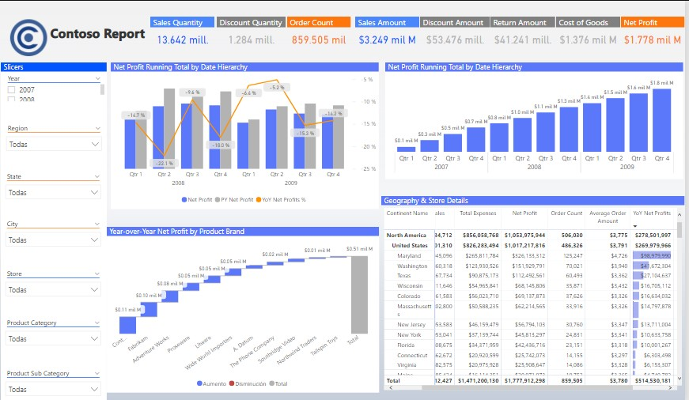

# Learning Power BI with Contoso Dataset

We will use the Contoso dataset to create a business report.

These are the report requirements:

**Data Visualization:**
* Net profit and net quantity breakdowns
* Year-Over-Year net profits comparison by month
* Net profit running historical running total
* Year-Over-Year Profits by Product Band

**Order details table:**
* Geopraphy information
* Net profits
* Net quantity
* Order count
* Average order amount
* Year-Over-Year net profits
* Year-Over-Year net profits %

**Report Filter:**
* Year filter
* Channel filter
* Geography and store filters
* Product filters

The final report will look like this:

