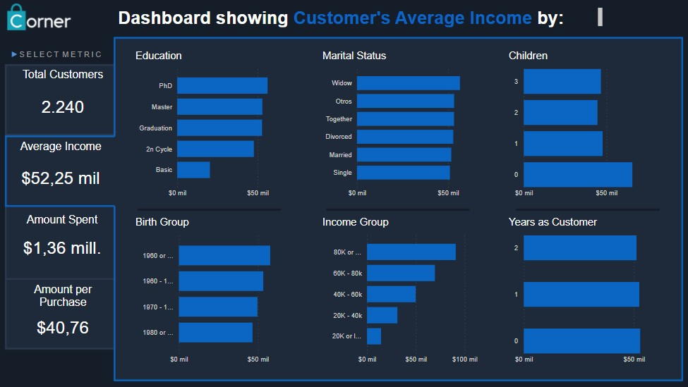

# Power BI with Marketing Dataset

This time we will use the Marketing dataset to create a business report.

We can find the dataset from this link:

[Marketing Dataset from Kaggle](https://www.kaggle.com/rodsaldanha/arketing-campaign?select=marketing_campaign.xlsx)

This report contains four parts:

1. Total Customers
2. Customers by Average Income
3. Customers by Amount Spent
4. Customers by Amount per Purchase

Those filters are grouped by six categories:

* Education
* Marital Status
* Number of children
* Birth Group
* Income group
* Number of years as customer

The final report, looks like this:

